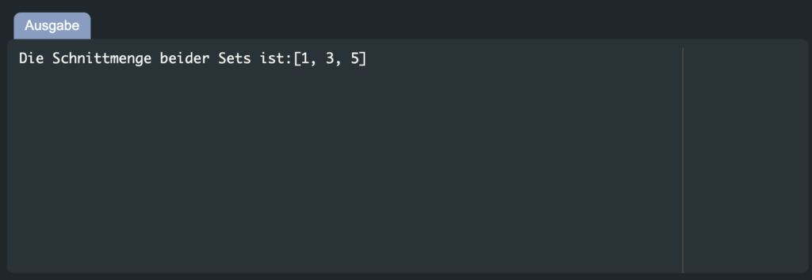

# Sets in Java

Java Set ist eine Schnittstelle, die Teil des Pakets `java.util` ist. Diese Set Schnittstelle erweitert das Collection-Framework, indem sie das Hinzufügen doppelter Elemente einschränkt. Außerdem kann man mit Hilfe der geerbten Methoden verschiedene Operationen mit einem Java-Set durchführen, wie z. B. das Hinzufügen, Suchen und Löschen von Elementen, das Überprüfen der Größe eines Java Sets und das Löschen des gesamten Inhalts des Java Sets auf einmal.

Um eine Set-Schnittstelle in Java zu erstellen, verwendet man eine der vier Klassen namens HashSet, TreeSet, EnumSet und LinkedHashSet. Danach kann man die Union, Intersection und Difference zwischen zwei Java Sets bestimmen, indem man die geerbten Methoden der Collection Schnittstelle verwendet.

## Hinzufügen von Elementen

Um Elemente einem Set hinzuzufügen, kann die Methode add() verwendet werden. Wenn das angegebene Element bereits in der Menge vorhanden ist, gibt die Set-Methode add() false zurück; andernfalls fügt sie das angegebene Element in die Menge ein und gibt true zurück.

Hinweis: Bevor das Set verwendet werden kann, muss das Paket `java.util.*` in das Programm importiert werden.

### Syntax

````java
javaSet.add("element");
````

### Beispiel

Als erstes erstellen wir ein `mitarbeiterSet` vom Typ `String` mit Hilfe der Klasse `HashSet`:

````java
Set<String> mitarbeiterSet = new HashSet<>();  
Anschließend rufen wir die Methode „add()“ auf, um die beiden Elemente „Alex“ und „Paul“ in das „mitarbeiterSet“ einzufügen:

mitarbeiterSet.add("Alex");  
mitarbeiterSet.add("Paul");  
System.out.println(mitarbeiterSet);
````

Die angegebene Ausgabe bedeutet, dass wir die festgelegten Elemente erfolgreich zu unserem `mitarbeiterSet` hinzugefügt haben. Das ganze Programm könnte dann so aussehen:

````java
import java.util.*;
public class Main {
    public static void main(String[] args) {
    
        Set<String> mitarbeiterSet = new HashSet<>();  
        mitarbeiterSet.add("Alex");  
        mitarbeiterSet.add("Paul");  
        System.out.println(mitarbeiterSet);
    
    }
}
````

Der Code würde in diesem Falle folgende Konsolenausgabe erzeugen:

Das Set Interface (The Set Interface) ist einer der etwas komplexeren Datenstrukturen in Java
Wie man die Größe eines Java Sets überprüft
Die Größe eines Java Sets lässt sich leicht mit der Methode `size()` ermitteln. Diese Methode gibt die „Länge“ oder „Anzahl der Elemente“ zurück, die in einem Java Set vorhanden sind.

### Syntax

```java
javaSet.size()
```

Hier gibt die Methode `size()` die Länge von **javaSet** zurück.

### Beispiel

Um die Größe des erstellten `mitarbeiterSet` zu überprüfen, rufen wir die Methode `mitarbeiterSet.size()` auf:

```java
System.out.println("Du hast so viele Mitarbeiter im Team: " + mitarbeiterSet.size()); 
```

Wie man an der Ausgabe sehen kann, ist die Größe unseres `mitarbeiterSet` 2:


## Wie man Elemente in einem Java Set sucht

Die Methode `contains()` wird verwendet, um ein Element in einem Java Set zu suchen. Diese Methode gibt einen booleschen Wert zurück, wobei `true` anzeigt, dass das gesuchte Element Teil des angegebenen Java Sets ist und `false` bedeutet, dass das gesuchte Element nicht gefunden wurde.

## Syntax

```java
javaSet.contains("element")
```

Hier sucht die Methode `contains()` nach "**element**" im **javaSet**.

## Beispiel

In unserem Java Programm fügen wir die unten stehende Anweisung ein, um das Element „**Paul**“ in „**mitarbeiterSet**“ zu suchen:

```java
System.out.println("Ist Paul Teil des Teams? " + mitarbeiterSet.contains("Paul"));
```

Da das Element „**Paul**“ im „**mitarbeiterSet**“ vorhanden ist, wird die Methode `contains()`  `true`` zurückgeben:

## Wie man Elemente aus einem Java Set löscht

Das Löschen von Elementen ist eine weitere grundlegende Operation zur Bearbeitung von Java Set-Elementen. In Java wird die Methode „remove()“ verwendet, um ein Element aus einem Java Set zu löschen.

### Syntax

```java
javaSet.remove("element")
```

Hier löscht die Methode `remove()` das angegebene „Element“ aus dem „javaSet„.

### Beispiel

Wir werden nun die „Alex“ Elemente aus unserem `mitarbeiterSet` mit Hilfe der `remove()` Methode löschen:

```java
mitarbeiterSet.remove("Alex");
```

Durch die Ausführung der Methode `mitarbeiterSet.remove()` wird „Alex“ aus dem `mitarbeiterSet` entfernt. Das ganze sieht dann so aus:

```java
import java.util.*;
public class Main {
    public static void main(String[] args) {
    
        Set<String> mitarbeiterSet = new HashSet<>();  
        mitarbeiterSet.add("Alex");  
        mitarbeiterSet.add("Paul");
        mitarbeiterSet.remove("Alex");
        System.out.println(mitarbeiterSet);
    
    }
}
```

Die Konsolenausgabe würde dann dementsprechend so aussehen.


## Grundlegende Java Set Operationen

**Java** bietet die Möglichkeit, die grundlegenden mathematischen Operationen mit einer Menge durchzuführen. Zum Beispiel haben wir zwei Java Set Arrays,` erstesSet = [1, 2, 3, 5, 0]` und `zweitesSet = [1, 3, 4, 5, 6, 7, 5]`, die möglichen Java Set Operationen sind: “Union” („Vereinigung„), “Intersection” ( „Schnittmenge„), und „Difference“ („Differenz„). Erfahre mehr über das Java Array.

Wir werden jede der genannten mathematischen Operationen im Detail demonstrieren.

### Java Set Operation I: Union

Mit der Operation `Union` werden die Elemente eines Java Sets zu einem anderen hinzugefügt. Wenn ein Element in beiden Java Sets vorkommt, wird es im resultierenden Java Set nicht hinzugefügt und seine Duplizierung wird verhindert.

#### Beispiel

Wir werden nun zwei Java Sets vom Typ Integer mit den Namen `erstesSet` und `zweitesSet` mit den folgenden Elementen erstellen:

```java
Set<Integer> erstesSet = new HashSet<Integer>();
erstesSet.addAll(Arrays.asList(new Integer[] {1, 2, 3, 5, 0 }));
Set<Integer> zweitesSet = new HashSet<Integer>();
zweitesSet.addAll(Arrays.asList(new Integer[] {1, 3, 4, 5, 6, 7, 5)); 
```

Im nächsten Schritt deklarieren wir ein „union“ Java Set  und übergeben „erstesSet“ als Argument, damit es die Elemente von „erstesSet“ kopiert:

```java
Set<Integer> union = new HashSet<Integer>(erstesSet);
```

Als nächstes rufen wir die Java Set-Methode `addAll()` auf und geben das `zweitesSet` als Argument an:

```java
union.addAll(zweitesSet);

System.out.print("Beide Sets zusammengeführt ergibt:");
System.out.println(union);
```

Dabei werden die Elemente beider Sets in das „union„-Java Set eingefügt.

Die Ausführung der angegebenen Methode `union.addAll()` fügt die Elemente von `zweitesSet` in das `union` Java Set ein:

Die Java asList-Methode konvertiert ein Array in eine Java List.

### Java Set Operation II: Intersection

Die gemeinsamen Elemente zweier Java Sets werden mit der Operation „Intersection“ abgerufen. Um die Implementierung der Java Set Operation Intersection kennenzulernen, schauen wir uns das unten stehende Beispiel an. Schau dir unser großes Java Tutorial an, wenn du Java lernen willst!

#### Wie man gemeinsame Elemente zweier Java Sets abruft

Um die gemeinsamen Elemente von `erstesSet` und `zweitesSet` abzurufen, erstellen wir zunächst ein weiteres Java Set mit dem Namen „intersection„, das eine Kopie der Elemente von `erstesSet` enthält:

```java
Set<Integer> schnittmenge = new HashSet<Integer>(erstesSet);
```

Danach rufen wir die Java Set-Methode `retainAll()` mit dem `intersection` Set auf und geben `zweitesSet` als Argument an:

```java
schnittmenge.retainAll(zweitesSet);
System.out.print("Die Schnittmenge beider Sets ist:");
System.out.println(schnittmenge);
```

Die Methode `retainAll()` fügt die gemeinsamen Elemente von `erstesSet` und `zweitesSet` zum Java Set `intersection` hinzu:



## Java Set Operation III: Difference

Die Java Set Operation “Difference“ entfernt die gemeinsamen Elemente von einer Menge zu einer anderen und funktioniert gegensätzlich zur Operation „Intersection„.

### Wie man die Differenz zwischen zwei Mengen findet

Im folgenden Beispiel verwenden wir die Methode „removeAll()„, um die Differenz zwischen „erstesSet“ und „zweitesSet“ zu ermitteln:

```java
// Die Differenz der Elements
// Difference of the Elements
Set<Integer> differenz = new HashSet<Integer>(erstesSet);
differenz.removeAll(zweitesSet);
System.out.print("Diese Elemente sind nicht im zweiten Set vorhanden:");
System.out.println(differenz);
```

Das resultierende Java Set `difference` enthält nur die Elemente von `erstesSet`, die in `zweitesSet` nicht vorhanden sind:


Das waren alle wesentlichen Informationen zur Verwendung von Sets. Du kannst bei Bedarf noch weiter recherchieren.

## Zusammenfassung

Die Set Schnittstelle ist im `java.util` Paket enthalten und ist eine Erweiterung des „Collection„-Frameworks, welches es verhindert, doppelte Elemente hinzuzufügen. In einem Java Set können verschiedene Operationen durchgeführt werden, wie z.B. das Hinzufügen, Suchen und Löschen von Elementen, das Überprüfen der Größe eines Java Sets, das Löschen des gesamten Inhalts des Java Sets auf einmal und die Operationen “Union” („Vereinigung„), “Intersection” ( „Schnittmenge„), und „Difference“ („Differenz„) zwischen zwei Java Set Objekten.

Quelle: [Codegree](https://codegree.de/java-set-der-grosse-guide/)
