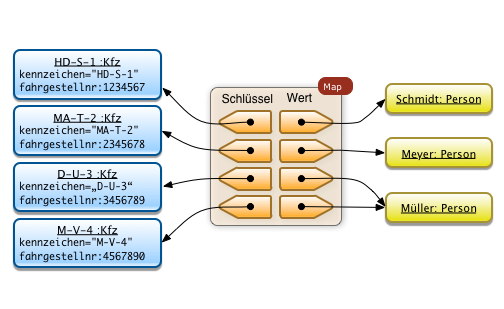
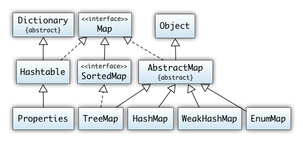
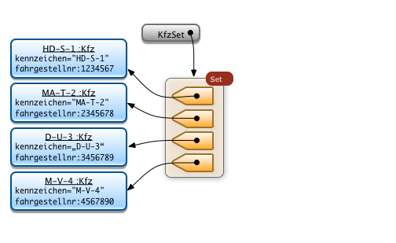
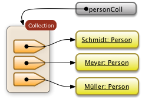

# Verzeichnisse-Maps (Collections)
Die Schnittstelle Map im Java Collections Framework erlaubt die Benutzung von Verzeichnissen (engl. Dictionary). Verzeichnisse sind Datenstrukturen in denen man Objekte organisiert nach einem beliebigen Schlüssel verwalten kann. Maps sind Modelle mathematischer Funktionen die einen gegebenen Wert einer Schlüsselmenge auf eine Zielmenge abbilden.

Maps funktionieren wie ein Wörterbuch. Man kann man sie als Tabellen mit zwei Spalten verstehen. In der ersten Spalte steht der Zugriffsschlüssel mit dem man nach einem Objekt sucht, in der zweiten Spalte steht das Objekt welches zu einem gegebenen Schlüssel gehört. Hierdurch werden zwei Objekte in eine Beziehung gesetzt.

## Anwendungsbeispiel
In einer Java-Map kann man zum Beispiel Kraftfahrzeuge und deren Halter verwalten. Da ein Kraftfahrzeug genau einen Halter hat, verwendet man das Kraftfahrzeug als Schlüsselobjekt. Die Person die das Fahrzeug besitzt wird als Wert verwaltet. Fügt man dieses Tupel von Schlüsselobjekt und Zielobjekt in die Datenstruktur ein, kann man zu jedem gegebenen Fahrzeug den Halter ausgegeben.



In Java-Maps müssen die Schlüssel eindeutig sein. Jedes Kfz kann daher nur einmal vorkommen. Die verwalteten Werte müssen nicht eindeutig sein. Im Beispiel oben besitzt die Person Müller zwei Kfz.

## Abgrenzung zu Objektattributen
Die oben aufgeführten Beispiel benutzte Beziehung zwischen einem Kraftfahrzeug und einem Halter kann man natürlich ebenso gut direkt mit Hilfe von Referenzen in den zwei Klassen modellieren.

Der Vorteil einer Java Map besteht darin, dass man diese Beziehung dynamisch in einem Javaobjekt modelliert und nicht permanent als Objekteigenschaft. Das Verwalten dieser Beziehung in einem Objekt hat die folgenden Vorteile:

- Man kann die Beziehung modellieren ohne die Klassen zu modifizieren
- Man kann jederzeit neue Beziehungen modellieren (z.Bsp Kraftfahrzeug<->Fahrer, Kraftfahrzeug<->Betreuer etc.)
- Man kann zusätzliche Operationen des Java Collection Frameworks ausnutzen um die Daten zu bearbeiten. Man kann z.Bsp.
    a) über alle Schlüssel iterieren (was ist die Menge der Kraftfahrzeuge?)
    b) über alle Objekte iterieren (was ist die Menge der Halter? Es kann mehrere Krfatfahrzeuge für einen gegebenen Halter existieren!)

## Klassenstruktur
Die Map-Klassen des Java Collections Framework werden nicht wie die anderen Klassen des Frameworks aus der Klasse Collection abgeleitet. Man kann jedoch mit Hilfe der Methoden keySet() und values() über die die Schlüssel oder über die eigentlichen Objekte iterieren.



## Klasse HashMap
HashMap<K,V> benutzt wie die Klasse HashSet einen Hash-Code für die Schlüssel mit deren Hilfe die Objekte verwaltet werden. Dadurch hat sie auch die gleichen Leistungseigenschafen wie die Klasse HashSet (in Bezug auf die Schlüssel).

Die Klasse HashMap erlaubt es beliebige Klassen als Schlüssel zu verwenden. Die einzige Bedingung ist, dass die Methoden equals() und hashCode() für diese Klassen implementiert sind (triviale Implementierungen existieren bereits in der Klasse Object).

## Klasse TreeMap
Die Klasse TreeMap implementiert die Schnittstelle SortedMap. Hierdurch wird sicher gestellt, das Objekte beim Einfügen direkt sortiert eingefügt werden. Die Schlüssel sind also bereits sortiert und erlauben eine effiziente Iteration in der Sortierreihenfolge.

Durch die sortierten Schlüssel ist es zum Beispiel möglich mit Hilfe der Schnittstellenmethoden von SortedMap einen Teilbereich auszuwählen. Ein Verzeichnis welches Zeichketten (Strings) als Schlüssel verwendet kann man z.Bsp. auf die folgende Weise einen Bereich erzeugen der alle Zeichenketten zwischen den Stringvariablen low und high enthält:

```java
SortedMap<String, V> sub = m.subMap(low, high+"\0");
```
## Weitere Klassen
Die Klasse `EnumMap` erlaubt das Verwalten von Aufzählungstypen (wie auch die Klasse EnumSet).

Die Klasse `WeakHashMap` erlaubt die Verwaltung schwacher Referenzen. Schwach referenzierte Objekte können in Java bei Bedarf vom Garbage Collector gelöscht werden. Sie benötigen daher eine gewisse Sonderbehandlung.

## Ausgewählte Methoden für Maps
Die Schnittstelle Map hat sehr viele Methoden, die man am besten in der Online API Dokumentation nachliest. Die wichtigsten Methoden werden hier kurz vorgestellt:

## Konstruktor
Die Konstruktoren sind nicht Teil der Schnittstelle. Sie hängen von den individuellen Ausprägungen ab. Anbei zwei Beispiele zum Erzeugen von Map-objekten wie sie im Beispiel oben gezeigt wurden:

```java
import java.util.HashMap;
import java.util.TreeMap;
import Person;
import Kfz;
Map<Kfz,Person> halterMapsortiert   = new TreeMap<Kfz,Person>();
Map<Kfz,Person> halterMapunsortiert = new HashMap<Kfz,Person>();
```

## Hinzufügen: `put(K key, V value)`
Tupel von Schlüsseln und Werten können mit der put(K key,V value) Methode hinzugefügt werden. Zwei Tupel für das obige Beispiel werden mit der folgenden Syntax eingefügt:

```java
Person p = new Person("Müller");
Kfz wagen1 = new Kfz("D-U-3",3456789);
Kfz wagen2 = new Kfz("M-V-4",4567890);
halterMapsortiert.put(wagen1,p);
halterMapsortiert.put(wagen2,p);
```

## Methode `get(Object key)`: Auslesen eines Wertes zu einem gegebenen Schlüssel
Die "klassische" Verzeichnisoperation ist das Auslesen eines Wertes zu einem gegebenen Schlüssel. Hierzu dient die `get(Object key)` Methode. Im obigen Beispiel kann man die Person "Müller" finden wenn man eines der Fahrzeuge dieser Person kennt. Die geschieht mit der folgenden Syntax:

```java
Person p = halterMapsortiert.get(wagen2);
```

## Methode `keySet()`: Auslesen alle Schlüsselelemente
Java-Maps erlauben auch das Auslesen aller Schlüssel mit der Methode keySet().

Man kann sich im obigen Beispiel die Menge (Javatyp Set) aller Kfz-objekte dem folgenden Kommando auslesen:

```java
Set<Kfz> KfzSet = halterMapsortiert.keySet();
```
Die neu erzeugte Menge zeigt auf die gleichen Schlüsselobjekte wie die Map:



Zum Auslesen der Mengenelemente muss man dann einen Mengeniterator anwenden.

## Methode `values()`: Auslesen aller Werte
Die Werte der Map werden mit der Methode `values()` ausgelesen. Im Beispiel von oben würde man die Werte der Map mit dem folgenden Befehl auslesen:

```java
Person p;
Collection<Person> personColl = halterMapsortiert.values();
Iterator<Person> iterPerson = personColl.iterator();
   while (iterPerson.hasNext()) {
      p = iterPerson.next();
      System.out.println("Person: " + p);
  }
```
Die zurückgebene Datenstruktur hat den Typ Collection. Der genaue Typ der Collection hängt von der gewählten Mapimplementierung ab.



Quelle: [scalingbits](http://www.scalingbits.com/java/javakurs2/programmieren2/collection/maps)